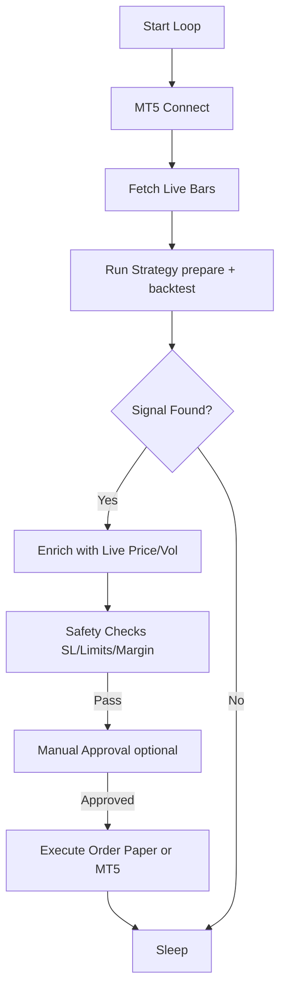

# Developer Guide — ICT Trading Bot

This guide provides technical details on how to extend and maintain the **treading-bot** project. It focuses on the patterns and lifecycle of the core components.

---

## 1. Indicator Pattern

Indicators are functional and stateless. They transform a pandas DataFrame by adding new logic-based columns.

### Rule: Functional Transformation
- **Input**: `pd.DataFrame` (OHLCV) + parameters.
- **Action**: Use vectorized pandas/numpy operations.
- **Output**: The same `pd.DataFrame` with additional columns.

### Example
```python
def detect_fvg(df):
    df['fvg_bull'] = (df['low'] > df['high'].shift(2))
    df['fvg_bear'] = (df['high'] < df['low'].shift(2))
    return df
```
*Location: `bot/indicators.py` or `bot/indicators_bos.py`.*

---

## 2. Strategy Pattern

Strategies are class-based and handle multi-timeframe logic.

### Lifecycle
1. **`__init__(...)`**: Store DataFrames for required timeframes (H1, M5, M1, etc.).
2. **`prepare_data()`**: Call indicator functions to enrich the DataFrames. Returns the enriched frames.
3. **`run_backtest()`**:
   - Loops through the primary timeframe (usually M1 or M5).
   - Evaluates higher-timeframe (HTF) bias and setup conditions.
   - Returns a `pd.DataFrame` of **signals** with columns: `time`, `type` (BUY/SELL), `price`, `sl`, `tp`, `reason`.

### Example Structure
```python
class MyStrategy(BaseStrategy):
    def prepare_data(self):
        self.df_h1 = detect_fvg(self.df_h1)
        # ...
        return self.df_h1, self.df_m5
        
    def run_backtest(self):
        signals = []
        for i in range(len(self.df_m5)):
            # bias -> setup -> trigger
            if trigger:
                signals.append({...})
        return pd.DataFrame(signals)
```
*Location: `bot/strategies/`.*

---

## 3. Live Trading Lifecycle

The `LiveTradingEngine` in `bot/live_trading.py` follows a strict loop controlled by `LIVE_CHECK_INTERVAL`.



### Key Safety Enforcements
- **Stop Loss**: Every trade *must* have a SL. Revalidated in `execute_signal`.
- **Daily Limit**: `MAX_TRADES_PER_DAY` is checked before signal execution.
- **Margin Check**: Free margin vs. required margin checked for live orders.

---

## 4. Configuration

All behavior is toggled via `config.py`. 
- **Backtest**: Uses `SYMBOLS` (Yahoo symbols).
- **Live/Paper**: Uses `LIVE_SYMBOLS` (MT5 symbol strings).
- **Manual Approval**: Set `MANUAL_APPROVAL = True` to confirm trades in the terminal.

---

## 5. Testing & Verification

- **Backtest**: Run `python main.py --mode backtest`.
- **Replay**: Run `python main.py --mode replay` to simulate the live loop on historical data.
- **Paper**: Run `python main.py --mode paper` to trade with virtual balance using live MT5 data.

---

See [ONBOARDING.md](../ONBOARDING.md) for a high-level overview.
